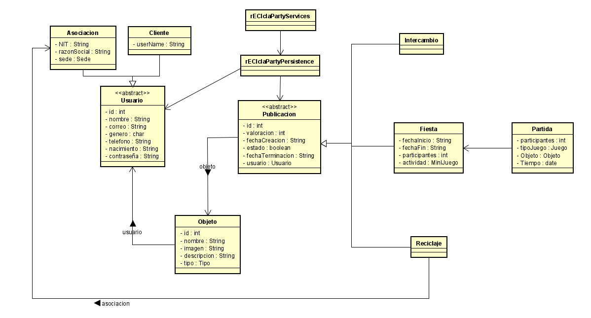
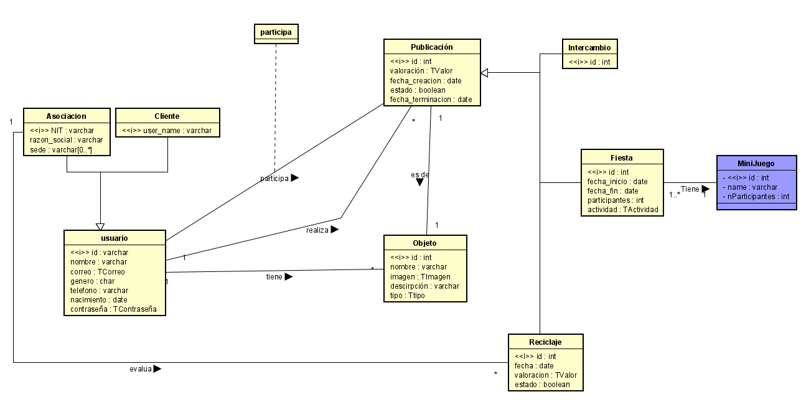
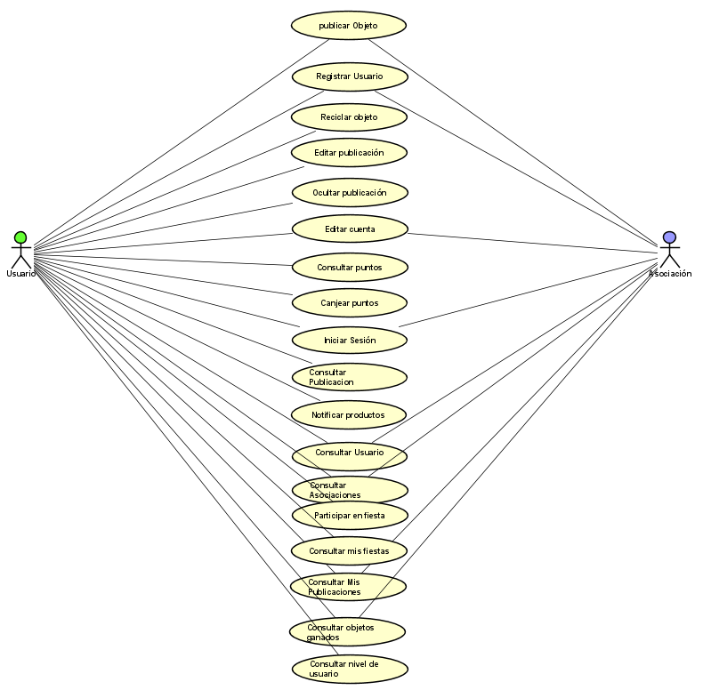
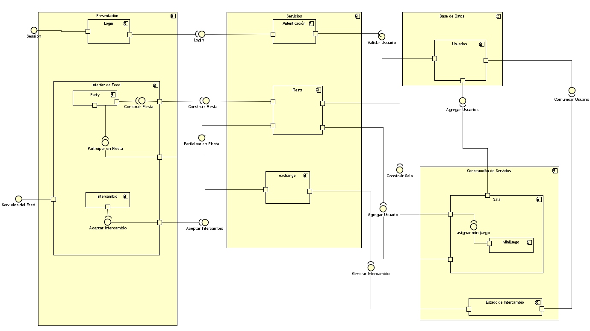

# rECIclaParty
## Integrantes

Juan Carlos Garcia Garzon

German Simon Marin Mejia

Edwin Yesid Rodriguez Maldonado

## Resumen
Reciclaparty es una aplicación dirigida a cualquier tipo de persona interesada en compartir un bien que ya no utilice, la aplicación se orienta también a la ayuda de
asociaciones que apoyen el reciclaje. El objetivo de esta aplicación web es poder crear un ambiente dinámico y divertido para que las personas puedan intercambiar objetos
y además puedan ayudar al medioambiente incentivando el reciclaje.

## Descripcion

Reciclaparty te permitirá crear publicaciones de fiestas en donde podrán participar un número de personas que determines, la hora y fecha que creas conveniente y un minijuego que te guste. Para poder regalar el objeto que estés dispuesto a compartir.

La persona que este inscrita a una fiesta, tendrá que intentar ganar un minijuego para poder adquirir el objeto que el creador de la fiesta acordó.

Las personas podrán unirse a una de las fiestas publicadas por la comunidad las cuales estarán en el fit de la página. Para poder ingresar a una publicación tendrás que tener un determinado número de puntos

Cada vez que crees una publicación recibirás una cierta cantidad de puntos, dependiendo del objeto publicado

También podrás contactarte con una asociación para donar el reciclaje que tengas en casa y así ayudar al medioambiente (esto también da puntos).

## Heroku

## Diagrama de clases

## Diagrama entidad relación de base de datos extendida

## Diagrama casos de uso

## Diagrama de componentes

